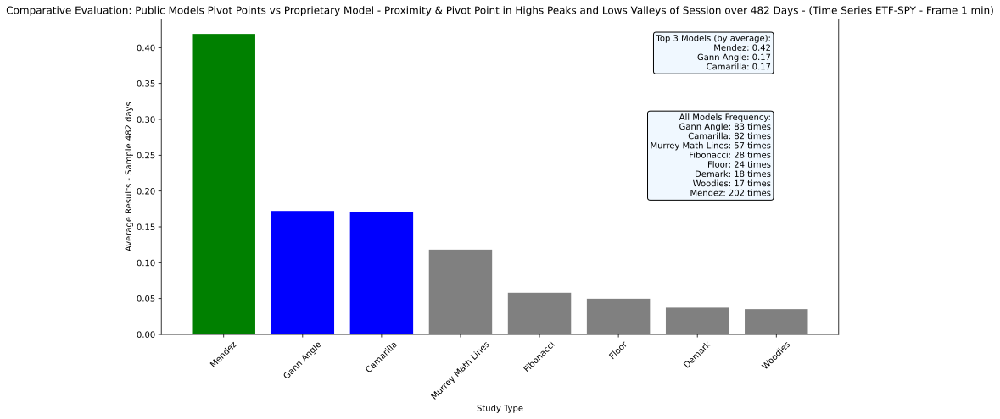

# Comparative-Pivot-Point-Models

Comparative Evaluation: Public Models Pivot Points vs Proprietary Model - Proximity, Precision and Frecuency-  Pivot Point in Highs Peaks and Lows Valleys of Session over 482 Days - (Time Series ETF-SPY - Frame 1 min).
Propietary Model: "Jump Into the Fractal Dispersion" Model (JiFD) / Nestor Mendez (Source Code: Not in script, Just Historical Real Pivots Points)
Author: Nestor Mendez
Year 2023, October, 7

> #### Disclaimer:
> For testing purposes only

## Installation

### WINDOWS: 

1. Updating `pip`
```bash
python.exe -m pip install --upgrade pip
py -m pip --version
```
2. Installing `virtualenv`
```bash
py -m pip install --user virtualenv
```
3. Creating a virtualenv:
```bash
py -m venv env
.\env\Scripts\activate
```

4. Install all dependencies:
```bash
pip install -r requirements.txt
```

## What are Pivot points?

Pivot points are technical analysis tools used to determine potential levels of support and resistance in the market. They are especially popular among intraday traders due to their ability to derive a variety of support and resistance levels based on the previous day's price activity.

Definition: A pivot point is a calculated price that is taken as a key indicator for the movement of an asset in the market. It is considered a significant technical level.

From the central pivot point, multiple support and resistance levels can be derived. These levels are calculated using differences between the previous day's high and low prices and the central pivot point.

### Utility:

Support and Resistance: The levels derived from pivot points act as supports and resistances on the chart. These levels indicate areas where the price might face obstacles.

Prediction of Price Movement: Traders often use pivot points to anticipate possible future price movements. If a price is above the pivot point, it might be considered a bullish sentiment, and if it's below, a bearish sentiment.

Entry and Exit Points: Traders can use these levels to identify possible entry and exit points for their trades.


### Objective:

The objective of this script is to conduct a comparative analysis between several public pivot point models, such as Fibonacci, Camarilla, Floor, Woodies, Demark, Gann Angle, and Murrey Math Lines, contrasting them with a proprietary model named 'Mendez (JIFD)'. 

This analysis aims to determine the accuracy, proximity, and frequency with which these models predict essential support and resistance levels. Specifically, the analysis focuses on how these models align with the index of the candlestick that has the highest price of the session (max-peak) and its corresponding OHLC values. 

Similarly, it considers the index of the candlestick with the lowest price of the session (min-valley) and its associated OHLC values. Therefore, the predicted levels must meet certain conditions to consider their proximity, accuracy, and frequency.

## RUN Script:

**Show help:**
```bash
py Comparative_Pivots_points.py --help
```
Expected answer:
```commandline
Usage: Comparative_Pivots_points.py [OPTIONS]

Options:
  -c, --csv_file TEXT  CSV file for analysis (default: data/ALL.csv)
  -f, --fig_name TEXT  name for the png image metric results (default:
                       metrics)
  --help               Show this message and exit.
```
**Run Script**
```bash
py Comparative_Pivots_points.py
```
Expected answer:
```commandline
****************************************************************
csv-file: data/ALL.csv
fig-name: metrics
****************************************************************
482 ----------
Searching...: 100%|█████████████████████████████████████████████████████████████████████████████████████████████████████████████████████████████████████████████████████████████████████████████████████████████████████████████████████████████████| 481/481 [00:55<00:00,  8.65it/s]
Total results of type 'Fibonacci': 28
Average results of type 'Fibonacci' by day: 0.06
Total results of type 'Camarilla': 82
Average results of type 'Camarilla' by day: 0.17
Total results of type 'Floor': 24
Average results of type 'Floor' by day: 0.05
Total results of type 'Woodies': 17
Average results of type 'Woodies' by day: 0.04
Total results of type 'Demark': 18
Average results of type 'Demark' by day: 0.04
Total results of type 'Gann Angle': 83
Average results of type 'Gann Angle' by day: 0.17
Total results of type 'Murrey Math Lines': 57
Average results of type 'Murrey Math Lines' by day: 0.12
Total results for 'Mendez': 202
Average results for 'Mendez' per day: 0.42
```

Output's image: 



### Abstract Propietary Model:

--- "Jump Into the Fractal Dispersion" Model (JIFD) ---

The spread in the prices of financial assets has long been a widely observed and studied phenomenon. However, the "Jump Into the Fractal Dispersion" (JIFD) model offers a unique perspective by suggesting an inherent fractal nature within this dispersion.

Central Thesis of the JIFD Model: Movements and fluctuations in the prices of financial assets exhibit patterns that repeat across different time scales, implying an underlying fractal structure in their spread.

Standard Deviation as Fractal Dispersion: JIFD introduces a prediction of daily or intraday standard deviation. Yet, rather than being merely a measure of spread, the predicted standard deviation becomes the cornerstone for constructing what the model terms as "fractal dispersion ranges." 

These ranges indicate the probable areas within which the asset's price is expected to fluctuate or the zones the price will breach, subsequently entering a new fractal self-similarity of dispersion.

Starting from a daily or intraday standard deviation prediction, JIFD uses the day's maximum and minimum price to initiate the construction of bidirectional dispersion ranges. These ranges act as supports and resistances, denoting areas within which price fluctuation is anticipated. 

As new data emerges, these ranges are dynamically recalculated to accommodate the ever-changing market conditions.

The significance of this process hinges on the prediction method employed to compute the standard deviation. In JIFD, a specialized proprietary model is leveraged to predict the standard deviation, infusing unique value and precision to the model.

## Conclusion

> Conclusion: The "Jump Into the Fractal Dispersion" model proposes a novel approach to understand and analyze the spread in financial markets. By identifying and leveraging the fractal nature of the spread, JIFD offers an analytical tool that can deliver unparalleled insights into the behavior of financial assets.


## Contact Me:

nestor.boza@gmail.com


